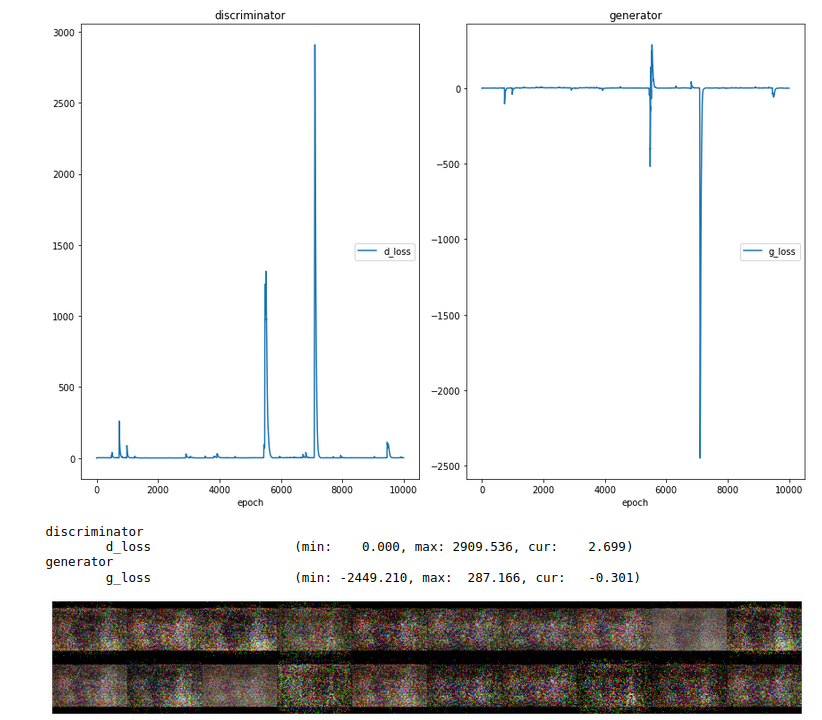

# ThumbGAN

This repository will record progress and final result of my subbmission for the course project in Applied Deep learning.

### Project Summary

**Relevant Literature:**

Here listed you will find the three most relevant papers this project will draw from:

The first one by Reed et al. discribes a similar method, creating images from text, but in the context of image creation from visual descriptions.

The second one is a heavily cited paper introducing the technique of a skip-gram model for word embedding. I plan to use this method or one based on it to generate the word vectors used as input in conjunction with the pictures.

Third is a paper by Goodfellow et al. which is heavily cited as the basis for the concept of Generative Adversarial Networks as a whole.

[1] Reed, S., Akata, Z., Yan, X., Logeswaran, L., Schiele, B. &amp; Lee, H.. (2016). Generative Adversarial Text to Image Synthesis. <i>Proceedings of The 33rd International Conference on Machine Learning</i>, in <i>Proceedings of Machine Learning Research</i> 48:1060-1069 Available from https://proceedings.mlr.press/v48/reed16.html.

[2] Mikolov, T., Chen, K., Corrado, G., & Dean, J. (2013). Efficient estimation of word representations in vector space. arXiv preprint arXiv:1301.3781.

[3] Goodfellow, I., Pouget-Abadie, J., Mirza, M., Xu, B., Warde-Farley, D., Ozair, S., ... & Bengio, Y. (2014). Generative adversarial nets. Advances in neural information processing systems, 27.

For PDF versions of the relevant papers and other ones that fit the topic please have a look at the Literature folder.

**Choice of Topic:** 
Generating Video Thumbnails from Video Title Text and assigned Tags using a Generative Adversarial Network

**Project Type:** Bring your own Data, Bring our own Method

**Project Description:**

The main goal for this project is to create and train a network that can generate passable YouTube video thumbnails based on the title. The network in question shall be structured similarly to what is described in Reed et al. (2016), Generative Adversarial Text to Image Synthesis. 

Their method proposes training of a Generative Adversarial Network (GAN) to synthesize pictures based on vector embeddings of a sentence describing the picture contents. I want to follow this approach regarding the network structure, but use a different method to generate the word embeddings for its input. In the past I achieved good results using pre-trained word vectors, provided for example as part of the fastText library, as input for neural networks. This seems to me to be a logical decision as it reduces the scale of the project in an aspect that is not its primary scope.

A data set will be created in which real video thumbnails are combined with their title and tags as found on YouTube.com. This will be done making use of the API provided by YouTube itself. Due to the large diversity on YouTube a sub selection of search terms will be chosen to serve as a basis for data collection. This hopefully enables the network to find patterns more easily thereby keeping the size of the training set at a reasonable level. 

To set a reasonable goal and to quantify the concept of a "passable" image two thresholds are defined. The first is the percentage of percentage of images correctly classified as real by the dicriminator. The second is the percentage of pictures created by the generator that could fool the discriminator. Each of these values alone does not identify a model as 'good', but in conjunction they create a quantifyable standard to work towards. The set goal for this project is an accuracy of 80% for the discriminator and an accuracy of 65% of the generator.

### Time Estimates

Due to the encounterd difficulty of the YT API Quota limit (see Data Collection - Scraper.ipynb) and the resulting time spent to find a work-around most of the time planned for creating and designing a model were moved back to be dealt with after the data set is completed.

Thus far I have spent around 35 to 40 hours in blocked sessions of 2 to 6 hours. 

The tasks 'Define Data Collection Rules' and 'Implement YT API Tool' were practically merged into one because of the encountered road blocks and took around 15 hours or three sessions. Accurately measuring the time spent on these tasks is difficult because a lot of it was done between sessions thinking of viable solutions.

Actually, collecting the data after that went smoothly for the data frame part (The video IDs, Titles, and Thumbnail URLS) but collection of the thumbnail JPG files took far longer than expected. Another three sessions were necessary to create a robust system to download the files. Although the data makes up only about 2  GB due to the large number of individual files the actual download took 2 days with constant monitoring and restarts in case of a loss of network connection.

Finally another 10 hours were spent collecting the vectorization model and finalizing the word vectors. Due to the large scale of the fasttext vectorization model (8.2 GB of Ram for the model alone) I ran into limitations regarding the hardware of my personal computer (16 GB RAM). 

## Intermediate Results

### Data Collection

Data collection is done in five steps, each step is performed in a separat python notebook.

- Scraper.ipynb

This notebook handles interaction with the YT API in order to gather the raw data. It includes multiple ways to scrape data. Due to Youtubes API quota not all ways to search are equally feasible. Searching for keywords is very costly and could only generate around 5000 videos per day. Searching for playlists by keyword and then gathering videos from the playlists is very inexpensive but introduces some duplicates. Efficiency of this method is further improved by letting the search results be ordered by the amount of videos in the playlists. This does not result in additional costs but increases the number of videos scraped per keyword search.

- removeDuplicates.ipynb

Because I opted for the second method to scrape data the removal of duplicates is necessary.

- getPictures.ipynb

Youtube does not provide the thumbnail picture itself but rather URLs to the picture in different resolutions. In this notebook the thumbnail of each video in the dataset is downloaded in the lowest quality. This can easily be changed in the code to result in the best quality being loaded.

- cleanUp.ipynb

In this Notebook the scraped data is cleaned up.
First, the instances that did not include a valid thumbnail link are removed (missing.txt in each subset folder).
Second, the title text is cleaned and standardized to make it ready for vectorization.
This includes casting all titles to lower case and replacing emojis with their test counter parts.

- vectorize.ipynb

The python library fasttext is used in combination with a pre-trained model available from their website to translate the title strings in the dataset to word vector representations.
To make the process of translation quicker, a vocablulatry set of all words in the data set is created, these are then translated to vector representations. Vocablulary and translation form a lookup table which is then used to add a word vector column to the data set. For the time the low number of 25 dimensions per word vector was used.

The final dataset CSV files and a folder with the pictures in low quality (120\*90) is available at:

https://archive.org/details/YT-Thumbnail-DataSet

As it stands now the data encompasses 448789 unique videos.

### Machine Learning Model

As of now, I have yet to implement and deploy the GAN architecture described in the paper of Reed et al. As an intermediate result and in order to have a working model for this hand-in I adapted the GAN shown in the lectures to fit my dataset. I wrote a custom data loader function to load a part of the created dataset and adapted the generator and discriminator to fit the shape of the data. Lastly, I updated the function showcasing intermediate results to fit the aspect ratio of the thumbnail pictures.

Pictures the generator creates at the moment are not resembling much of any shape or form of the input data. It can however be seen that the model technically works. Most of the thumbnails do not share the aspect ratio of 4:3 that Youtube expects. Black bars are therefore visible at the top and the bottom of many thumbnails. This is a characteristic that the model quickly learns.

