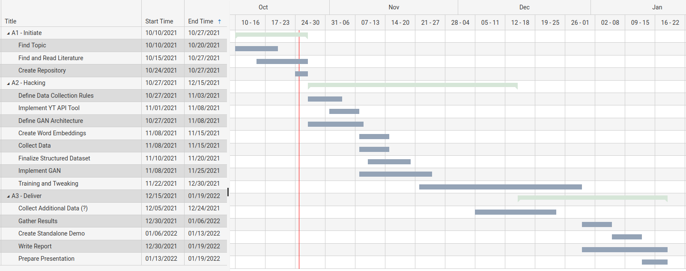

# ThumbGAN

This repository will record progress and final result of my subbmission for the course project in Applied Deep learning.

### Project Summary

**Relevant Literature:**

For PDF versions of the relevant papers please have a look at the Literature folder.

**Choice of Topic:** 
Generating Video Thumbnails from Video Title Text and assigned Tags using a Generative Adversarial Network

**Project Type:** Bring your own Data, Bring our own Method

**Project Description:**

The main goal for this project is to create and train a network that can generate passable YouTube video thumbnails based on a title and a set of tags. The network in question shall be structured similarly to what is described in Reed et al. (2016), Generative Adversarial Text to Image Synthesis. 

Their method proposes training of a Generative Adversarial Network (GAN) to synthesize pictures based on vector embeddings of a sentence describing the picture contents. I want to follow this approach regarding the network structure, but use a different method to generate the word embeddings for its input. In the past I achieved good results using pre-trained word vectors, provided for example as part of the fastText library, as input for neural networks. This seems to me to be a logical decision as it reduces the scale of the project in an aspect that is not its primary scope.

A data set will be created in which real video thumbnails are combined with their title and tags as found on YouTube.com. This will be done making use of the API provided by YouTube itself. Due to the large diversity on YouTube a sub selection of search terms will be chosen to serve as a basis for data collection. This hopefully enables the network to find patterns more easily thereby keeping the size of the training set at a reasonable level. 

### Time Estimates

